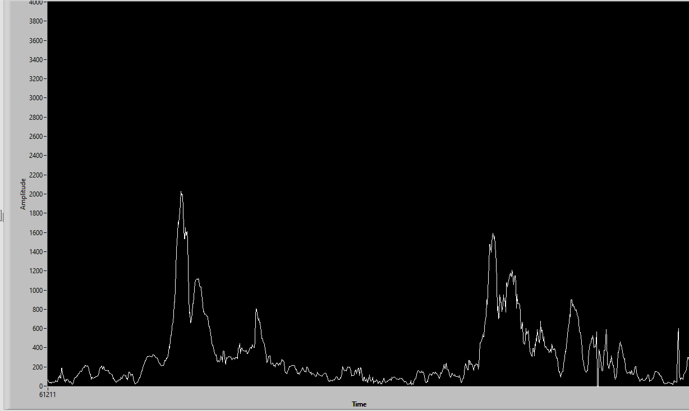

# Introduction

The system is designed to be implemented using the accelerometer modules and peripherals available on the FRDM-KL46z board. The system 
reads the data from the sensor, processes it to detect the user's footsteps, and displays the number of detected footstep on built in LCD.  

## System Architecture

| Number  | Peripheral | Function |
| :-------------: | :-------------: | :-------------: |
| 1  | SW1  | Start/Stop Counter  |
| 2  | SW3  | Reset step number to zero when the system is active  |
| 3  | Red led  | Turn off when system is active, turn on when system down  |
| 4  | Green led  | Flicker when system is active,  turn off when system down |
| 5  | LCD  | Display the number of footstep  |
| 6  | MMA8451Qs Cell  | Collect acceleration value.  |

## Flow chart of system: 

- The program begins with initializing the system's operations, including setting up the clock and configuring the operating modes for the system's modules:

- After completing the setup of the modules, the program initializes the variables for the process of reading and processing data from the sensors to detect the user's footsteps:

    &nbsp; - The variables number_of_peak_detect and number_of_bottom_detect are used to count the number of peaks and the number of troughs of the acceleration values read from the sensor; these two variables are initialized with a value of 0.
  
    &nbsp; - The variables thread_hold_number_bottom and thread_hold_number_peak are used to determine the threshold values, which, when exceeded, will change the control flow. These two variables are assigned default values of 20 and 150.
  
    &nbsp; - The variables thread_hold_bottom and thread_hold_peak are used to determine the threshold such that when the recorded acceleration is greater than thread_hold_peak or less than thread_hold_bottom, it is considered a peak value or a bottom value.
  
    &nbsp; - The variable is_detecting_step is used to control the execution flow of the program. This variable is assigned a value of 1 when number_of_peak_detect is greater than thread_hold_number_peak, and is reset to 0 when the user's footsteps are detected.

- Explain more about the step counter detection algorithm:

- We notice that after each step, the value of acceleration will form wave peaks as shown in the image. To detect the number of steps, we need to identify these wave peaks. The algorithm is divided into two stages:

   &nbsp; - Stage 1: Detecting the wave peak: The system continuously reads data from the sensor; when it detects that the current value is greater than the threshold value of the wave peak (thread_hold_peak), it increments the variable counting the number of detected wave peaks (number_of_peak_detect) by one. When the number of detected wave peaks exceeds the threshold value (thread_hold_number_peak), the system transitions to Stage 2 (is_detecting_step = 1).

  &nbsp; - Stage 2: Wave bottom detection: When the input value is detected to be less than the wave bottom threshold (thread_hold_bottom), it increments the variable counting the number of detected wave bottoms (number_of_bottom_detect) by one. When the number of wave bottoms exceeds the threshold value (thread_hold_number_bottom), the system will consider it as detecting the user's footsteps, it will update the number of steps (number_of_step), display the new number of steps on the LCD, and then reset the values of the counting and control variables.

## More

To understand more deeply about the system, you coud check my report attached at Document folder: https://github.com/TranNamCHY/SmartLock/tree/main/Documen
