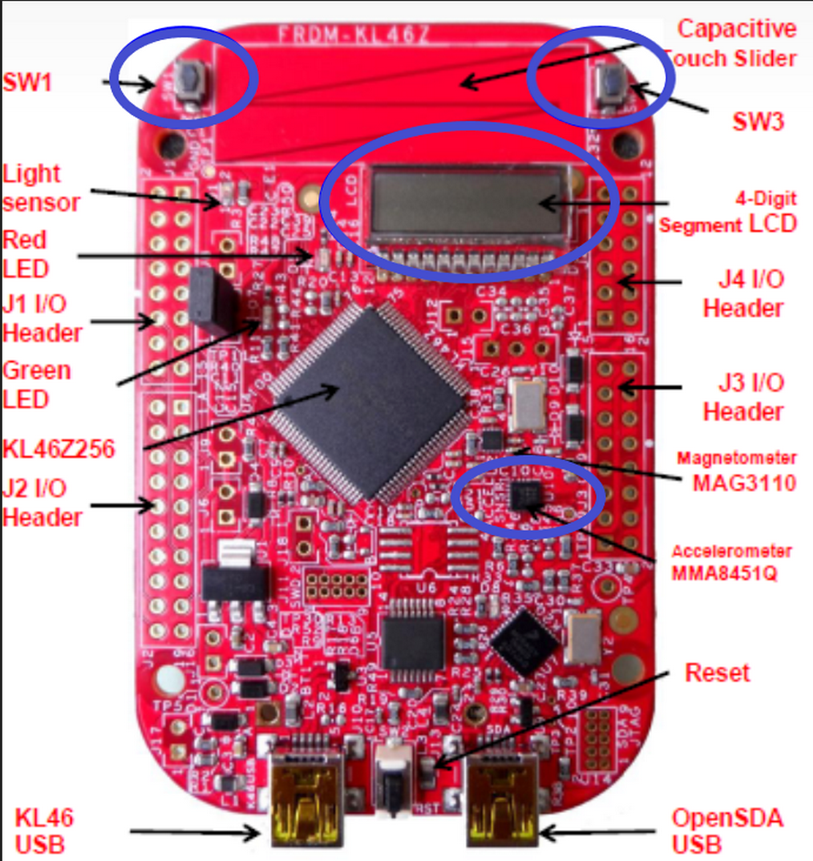
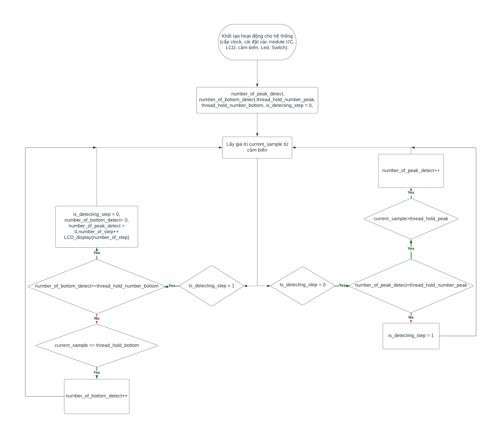

# Introduction
The system is designed to be implemented using the accelerometer modules and peripherals available on the FRDM-KL46z board. The system 
reads the data from the sensor, processes it to detect the user's footsteps, and displays the number of detected footstep on built in LCD.  

## System Architecture

| Number  | Peripheral | Function |
| :-------------: | :-------------: | :-------------: |
| 1  | SW1  | Start/Stop Counter  |
| 2  | SW3  | Reset step number to zero when the system is active  |
| 3  | Red led  | Turn off when system is active, turn on when system down  |
| 4  | Green led  | Flicker when system is active,  turn off when system down |
| 5  | LCD  | Display the number of footstep  |
| 6  | MMA8451Qs Cell  | Collect acceleration value.  |

## Flow chart of system: 

- The program begins with initializing the system's operations, including setting up the clock and configuring the operating modes for the system's modules:

    &nbsp; - The system receives the Who request from the ESP8266 through an interrupt from the UART1 module.
  
    &nbsp; - The system sends back a confirmation message for the program on STM32, which is currently an application program.
  
    &nbsp; - If it receives feedback from the ESP8266 that there is a new firmware version and an update is required, the system immediately resets to address 0x0800000 to switch to the Bootloader program's operation flow.
  
    &nbsp; - The Bootloader program continues to receive Who requests from the ESP8266 and responds by confirming that the STM32 is in the Bootloader program.
  
    &nbsp; - The system waits until it receives a START response from the ESP8266 and begins the process of receiving and writing firmware into the flash memory.
  
    &nbsp; - The firmware will be transmitted line by line in HEX format. STM32 reads each line and checks for errors using a 2-byte checksum at the end of each record. If an error is detected, it will request the retransmission of that record.
  
    &nbsp; - If too many errors occur in a single record, the system confirms there is a fault in the physical transmission, at this point, the system will be reset and return to the initial state of the Bootloader program.
  
    &nbsp; - After completing the reading and writing of firmware into the flash memory designated for the application program, the Bootloader will perform the procedure to jump to the recorded application program. This includes resetting the PC pointer and vector table to the address of the new program, disabling the clock source of the peripherals, etc.

Flow chart of Minor system:

## More

To understand more deeply about the system, you coud check my report attached at Document folder: https://github.com/TranNamCHY/SmartLock/tree/main/Document
